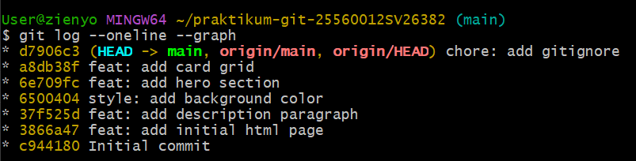
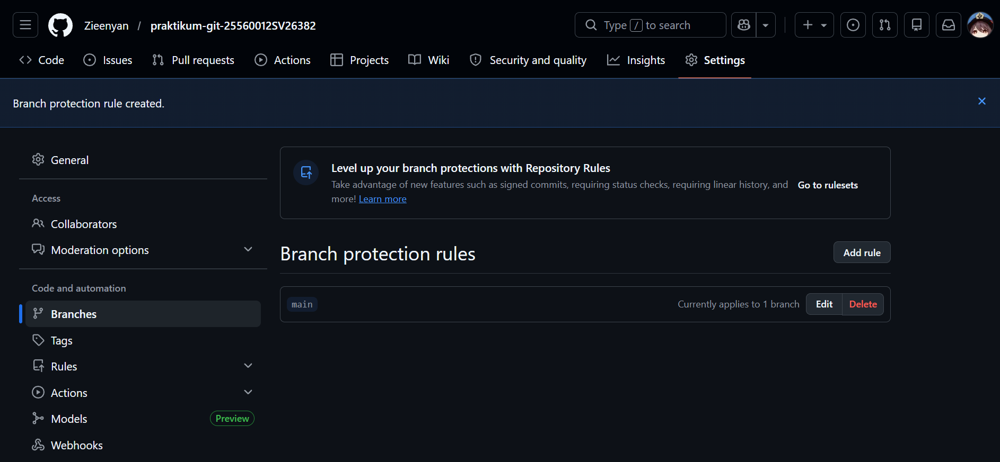
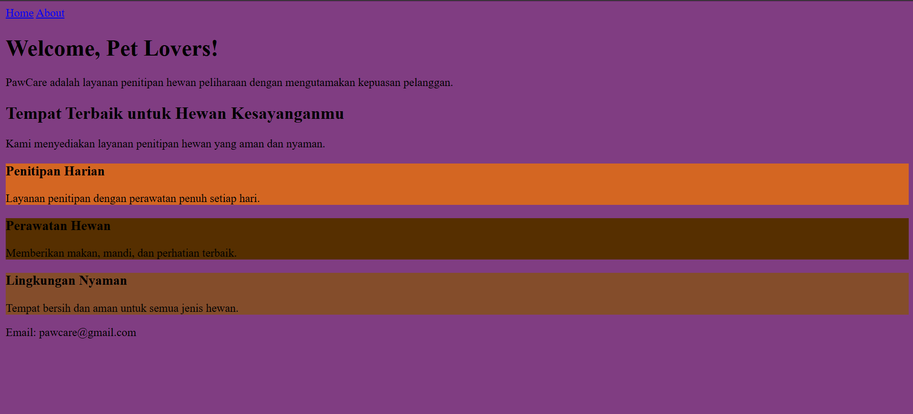
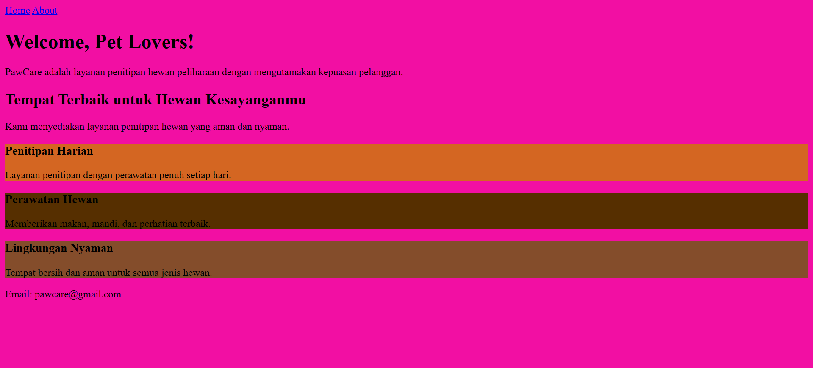
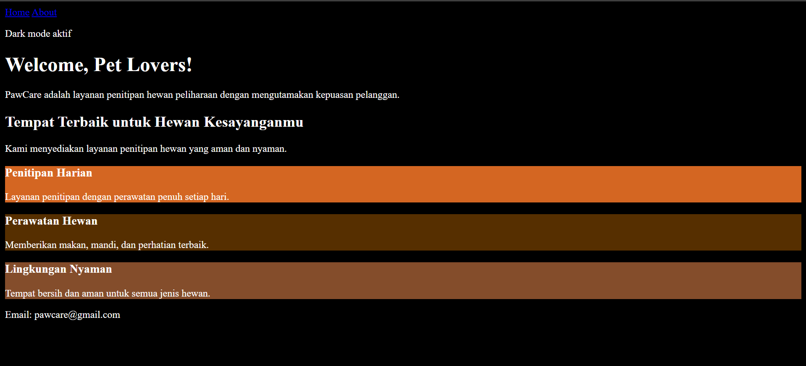
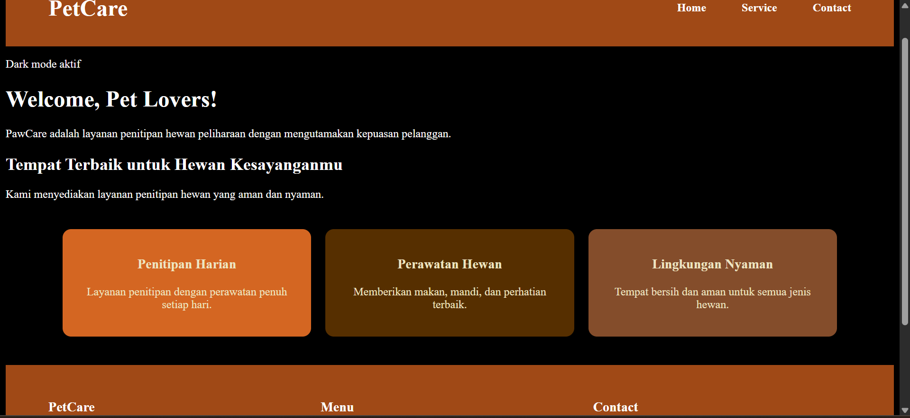

# praktikum-git-25560012SV26382

# Deskripsi Project
Project ini merupakan praktikum Git yang mencakup:
1. Inisialisasi & Commit History, yaitu membuat repository baru, clone ke lokal, melakukan 5 commit dengan pesan, pembuatan file .gitignore, dan menyertakan hasil log --oneline --graph pada README.md
2. Branching & Pull Request, yaitu membuat 3 branch (feature/navbar, feature/footer, dan hotfix/typo), melakukan Push masing-masing branch,  membuat 2 Pull Request terpisah, melakukan Merge semua PR, dan memasang Branch Protection Rule pada branch main.
3. Konflik & Rebase, yaitu melakukan simulasi konflik pada branch dan menyelesaikannya secara manual, serta membuat branch untuk dark mode dan menggunakan interactive rebase untuk menggabungkan 3 commit menjadi 1 commit dengan pesan yang baik.
4. Dokumentasi & Invite, yaitu melengkapi README.md dengan proses pengerjaan Tugas 1 hingga 4, membuat 3 isu di GitHub, dan menutup isu dengan PR yang dikaitkan dengan Closes #nomor, serta invite collaborator akun dosen dan asprak.

# Cara Menjalankan Tugas 1
1. Membuat repository baru di GitHub
2. Clone repository: git clone https://github.com/Zieenyan/praktikum-git-25560012SV26382.git
3. Masuk folder project: cd praktikum-git-25560012SV26382
4. Membuat file index.html berisi website sederhana di VSCode dengan perintah git add index.html.
5. Menggunakan perintah git add . dan melakukan commit pada setiap perubahan yang terjadi, sebagai contoh: git commit -m "feat: add initial html page" untuk menambahkan perubahan dan menyimpannya ke history Git.
6. Membuat file .gitignore dengan perintah: touch .gitignore, lalu diisi dengan . DS_Store, *. log, node_modules /
7. Melakukan commit kembali dengan add terlebih dahulu, yaitu git add .gitignore dan git commit -m "chore: add gitignore"
8. Melakukan dokumentasi pada README.md dengan mmemberi kode: , serta menambah foto di folder yang sama.
9. Menambah gambar dengan perintah git: git add [file gambar] README.md.
10. Melakukan commit dan memberikan teks.
11. Terakhir adalah melakukan push ke GitHub dengan perintah: git push origin main.
12. Hasilnya adalah sebagai berikut.

# Cara Menjalankan Tugas 2
1. Sebelum membuat branch, pastikan berada di main dengan menggunakan perintah: git checkout main.
2. Gunakan perintah git pull untuk mengambil (fetch) sekaligus menggabungkan (merge) perubahan terbaru dari repository GitHub ke lokal.
3. Buat branch navbar dengan perintah: git checkout -b feature/navbar
4. Setelah itu, tambahkan file navbar di file index.html, lalu lakukan commit dan push dengan perintah: git add ., git commit -m "feat: add navbar", dan git push origin feature/navbar
5. Lakukan compare dan pull request di GitHub dengan klik button hijau dengan text "Compare & Pull Request". Isi title, deskripsi, dan pilih label dengan menyesuaikan perubahannya.
6. Lakukan hal yang sama pada feature/footer dan hotfix/typo. Pada hotfix/typo, perubahan yang dilakukan pada file index.html adalah terkait dengan koreksi typo yag terdapat pada file.
7. Setelah itu, lakukan Squash and Merge pada feature dan Merge Commit pada hotfix. Hapus branch setelah merge dilakukan. 
8. Buka tab setting, pilih branches. Setelah itu, klik Add Classic Branch Protection Rule, lalu beri ceklis pada "Require a pull request before merging". 
9. Hasilnya adalah sebagai berikut.

# Cara Menjalankan Tugas 3
1. Pembuatan branch dilakukan dengan memulai dari main: git checkout main, git pull, dan git checkout -b experiment/color-A untuk membuat branch.
2. Setelah itu, edit file index.html, sebagai contoh background-color pada body menjadi warna ungu. Setelah itu, lakukan perintah: git add ., git commit -m "feat: set background purple", dan git push -u origin experiment/color-A untuk commit dan push ke GitHub.
3. Cara yang sama dilakukan untuk experiment/color-B. Pada experiment ini dilakukan pergantian warna background menjadi pink. 
4. Setelah itu, lakukan Pull Request dan Merge pada keduanya.
5. Pada experiment/color-B akan terjai konflik. Untuk memperbaiki konflik tersebut, dilakukan penyelesaian secara manual di VSCode dengan memilih satu background color.
6. Apabila tidak terdapat koflik yang
ditampilkan, tutup file index.html pada VSCode dan gunakan perintah: git merge experiment /color -A dan git merge experiment /color -B untuk melakukan merge via Git.
7. Selanjutnya lakukan add, commit, dan push dengan perintah: git add ., git commit -m "fix : resolve merge conflict", dan git push.
8. Selanjutnya membuat branch baru, yaitu feature/dark mode dengan perintah: git checkout main, git pull, dan git checkout -b feature/dark-mode
9. Pembuatan tiga commit yang dilakukan adalah mengubah warna background menjadi hitam, mengubah warna teks menjadi putih, dan menambah teks bahwa dark mode telah aktif. Setiap perubahan dilakukan perintah: git add . dan git commit -m "[teks]"
10. Setelah itu, gunakan perintah: git log --oneline dan git rebase -i HEAD ~3 untuk mengecek commit, serta menggunakan interactive rebase untuk menggabungkan ketiga commit menjadi satu commit dengan pesan yang
baik.
11. Buka VSCode kemudian edit commit2 dan commit3 menjadi squash.
12. Tutup kembali VSCode,
lalu Git akan membuka editor. Ubah menjadi satu pesan commit yang baik. 
13. Setelah itu, push
ke GitHub. Buka GitHub untuk melakukan Pull Request dan Squash and Merge. Tidak lupa memberikan judul dan deskripsi yang sesuai dengan perubahan yang dilakukan
14. Hasil dari perubahan website adalah sebagai berikut

# Cara Menjalankan Tugas 4
1. Buat 3 issue pada GitHub sebagai perencanaan perbaikan untuk ke depannya.
2. Untuk menyelesaikan issue tersebut, buat branch feature/navbar-improvement.
3. Pastikan telah berada di main dengan perintah: git checkout main, lalu pull dengan perintah: git pull.
4. Buat branch dengan perintah: git checkout -b feature/navbar-improvement
5. Edit kode sesuai dengan issue yang dibuat, sebagai contoh pada issue pertama adalah terkait navbar yang masih sederhana sehingga kode pada file ditambah menu dan style.
6. Setelah selesai, gunakan perintah berikut untuk menambah, commit, dan push perubahan: git add ., git commit -m "feat: improvement navbar", dan git push -u origin feature/navbar-improvement.
7. Buka GitHub, lalu lakukan Compare dan Pull Request.
8. Dalam pengisian PR, tambahkan Closes #(sesuaikan dengan nomor issue) di deskripsi untuk menutup issue. 
9. Selanjutnya lakukan Squash and merge, serta delete branch. Issue yang telah diselesaikan akan tampil
sebagai issue yang telah ditutup.
10. Lakukan cara yang sama untuk sisa issue sehingga issue tersebut dapat diselesaikan dengan baik.
11. Untuk invite collaborator, buka settings di GitHub dan pilih Collaborators. Invite akun dosen dan asprak.
12. Hasil dari website dengan issue yang telah diselesaikan adalah sebagai berikut.

# Screenshot Website

# Git Log

#  Branch Protection Rule

